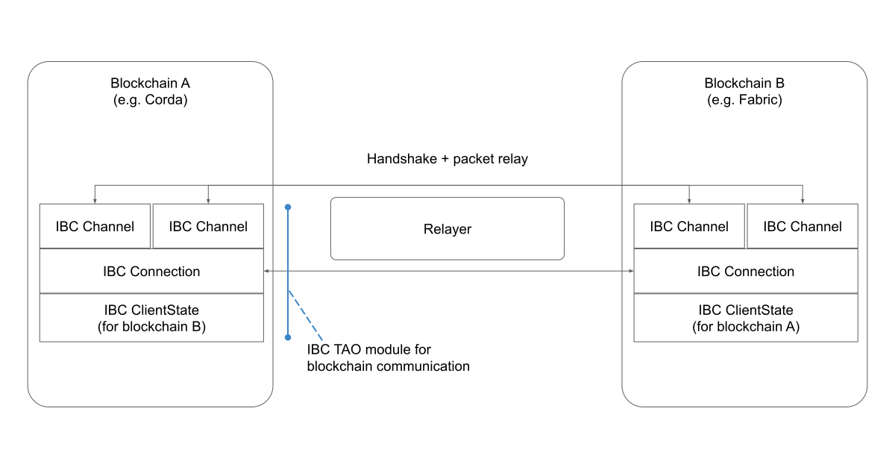

# HIP Identifier
Hyperledger YUI

# Sponsor(s)
* Jun Kimura, CTO, Datachain, Inc. - https://github.com/bluele
* Ryo Sato, Datachain, Inc. https://github.com/3100
* Masanori Yoshida, Datachain, Inc. - https://github.com/siburu
* Jeffrey Hu, director of research, Bianjie AI - https://github.com/HuLaTown
* Shinichi Yamashita, NTT DATA - Shinichi.Yamashita@jp.nttdata.com

# Abstract
The Hyperledger YUI is an interoperability project to achieve trustless application-agnostic exchange of information for heterogeneous blockchains both enterprise permissioned and public blockchains.

# Context
Since the beginning of 2020, the team behind YUI has been working on interoperability problem, as it became obvious there will be many heterogeneous blockchain networks in a near future.

The vision of YUI for blockchain networks is summarized in two key concepts. That is;
- Enable general computation between networks (not just token transfer)
- Keep it as decentralized as possible, i.e., Do not introduce additional trust in the network

To fulfill the above concepts, the team focused on Inter Blockchain Communication protocol (IBC) designed and implemented as the core functionalities of Cosmos network. Though the original IBC aimed to make network of public blockchains, the team applied the technology for enterprise and consortium blockchains.

The team put together modules for major enterprise blockchain, namely Hyperledger Fabric, Besu, and Corda and contributed to Hyperledger as a Lab called YUI in June 2021.

After the lab is set up, YUI has been actively engaging with open source communities including presentation in Hyperledger Global Forum and meetup. Discussions within forum on GitHub resulted in grant opportunities from Interchain Foundation as well as collaboration with public blockchain projects like Harmony and Celo (ChorusOne). Also enterprises like NTT Data are applying YUI for projects for proof of concepts planned for commercial use.

# Dependent Projects
*(WIP)*
- IBC from Cosmos
- Hyperledger Fabric
- Hyperledger Besu

# Motivation
*(WIP:Key sentences)*

As the commercialization of products and solutions based on blockchains progresses, there is a growing need for interoperability solutions to connect multiple blockchain systems.

A straightforward way to bring interoperability would be to exchange data via a certain authority or a trusted third party (TTP). Traditional API between blockchain systems fall into this category in terms of trusting the endpoint provider of API. On the other hand, there are issues with this method, thus solutions that do not rely on a TTP are needed.

One of the issues is that the TTP (in the API example, a provider or an administrator of API endpoint) must be trusted by all participants, which requires cost for trust, and sometimes impractical assumption to maintain, especially in a network with frequent change in participants.

In addition, the complexity of the entire system is increased because it requires a mechanism for information exchange which typically involves off-chain modules, such as API. This requires storing and maintaining intermediate states on off-chain, resulting in high cost for achieving availability and consistency.

There exist similar solutions to the TTP, that is to connect multiple blockchains to a single system. (This is sometimes referred to as an “integrated” solution.) However, such a system has the challenges of TTP and the cost of requiring developers to understand and operate multiple layers (“integrated” and “individual” layers).

# Status
Proposal

# Solution
*(WIP:Key sentences)*

Based on the above motivation, we propose the Hyperledger YUI, which aims to satisfy the following properties. (This also structures design principles)
1. Provide a unified communication method independent from a specific blockchain/DLT implementation
    * This enables application developers to develop chain-agnostic application logics.
2. Support arbitrary data transfer and computation
    * Developers can design and implement the specific protocol for its cross-chain application, not limited to token transfer use cases.
3. Cross-authentication
    * By relying on the on-chain verification of the other chain’s state, cross-chain communication can be achieved without any safety concern due to the behavior of off-chain actors
    * This allows cross-chain message relaying not only to the trusted and privileged actors, but also to any actor that satisfies the ACL of the permissioned chain.
    * In addition, we aim to apply the method not only to the permissioned chains, but to the public chains as well.
4. Avoid adding components that introduce additional trust (apart from individual blockchains)
    * Introducing such components may decrease the level of security of a system as it would be bounded by the lowest component in the system.
    * Also, introducing new (off-chain) components with high fault tolerance will also lead to increased operational costs
5. Do not introduce a new layer (such as integration layer)
    * Each actor (of blockchains) has only to interact with a respective blockchain of its interest to complete a cross-chain operation unless the application has additional requirements. 

In order to achieve interoperability that satisfies design principles above, YUI focuses on inter-blockchain communication protocol (IBC) designed as a core component of the Cosmos network and applies it to the enterprise blockchain domain to achieve communication between blockchains.

IBC enables communication among heterogeneous blockchain with TAO property, namely, (reliable) transport, authentication, and ordering. 

* “Reliable” means that only a packet that is exactly sent by a source chain is received by a destination chain exactly once. In fact, blockchains themselves never communicate with other blockchains. Thus a “relayer” needs to relay packets from one to another, but the role of relayer is permissionless; that is, anyone can run relayers.
* “Authenticated” means that IBC uses “channel” abstraction described later when relaying packets and that each end of a channel is exclusively assigned to a specific smart contract. Thus, if a packet is received by a destination chain via a channel, it proves that a specific smart contract assigned to the channel on a source chain sent the packet and that any other smart contracts can never use the channel to send packets.
* “Ordered” means that a destination chain receives packets in the same order in which a source chain sends the packets.

Modules for IBC communication are implemented as smart contracts that operate on both blockchains and consist of the following components:
* On-chain light client
* Connection abstraction
* Channel abstraction

Fig1: Architecture with IBC modules

The on-chain light client is a basis for IBC/TAO, which verifies that presented states actually exist on an opposite blockchain without relying on any trusted third parties. On top of that, connection abstraction and channel abstract are defined and used to connect two smart contracts on two blockchains and to relay packets between them.

Cosmos network defines the standard of these modules (called ICS, Inter-Chain Standard). Hyperledger YUI designed and implemented these modules in enterprise domain, currently supporting Hyperledger Fabric, Besu, and Corda.

For example, IBC requires Commitment Proof which can be verified by the on-chain light client to check if a certain state (a key value pair) exists (or does not exist) in the target blockchain. For this reason, the specification of commitment proof for each blockchain should be defined.

In YUI-Fabric-IBC, which is a collection of modules for Hyperledger Fabric, we designed and implemented Endorsed Commitment, a design for commitment proof for Hyperledger Fabric.

In Hyperledger Fabric, basically state updates and corresponding blocks are signed by endorser(s) to be accepted. 

Thus in YUI-Fabric-IBC, read/write set of a certain key/value pair signed by the appropriate endorser(s) can formulate a proof of the state (called an Endorsed Commitment). The on-chain light client can verify these signatures provided endorsement policy of target blockchain.

On top of YUI, developers can implement several cross-chain applications, examples are:
* Cross-chain token transfer
* Cross-chain Atomic swap
  * Example includes delivery versus payment settlement
* Cross-chain atomic execution of arbitrary procedures

# Effort and Resources
(WIP)

# How To
(WIP)

Refer to yui-docs repository

# References
(WIP)

# FAQs
## What is the Hyperledger YUI?
The Hyperledger YUI is an interoperability project to achieve trustless application-agnostic exchange of information for heterogeneous blockchains.

## How is Hyperledger YUI different from Hyperledger Cactus?
1. As stated in design principles above, YUI only rely on on-chain governance for safety (or trust) in cross chain operations
   * Each actor of ledgers has to interact with only a respective ledger of its interest to complete a cross-chain operation; i.e., Developers for cross chain operations should only care about on-chain modules for both ledger (to communicate)

* However, Cactus introduce Cactus layer (with Cactus Node Server) to provide unified access for interoperability. This is also the reason that Cactus is sometimes introduced as “integration framework” not “interoperability solution"
* This results a significant difference on module composition. Most of the YUI modules are on-chain contract while Cactus has several off-chain modules (including Cactus Node Server)

2. YUI is a project based on Inter Blockchain Communication protocol and it defines a standard data model and an unified communication method independent from a specific DLT
* However, in Cactus, it lets developers for each project to design and implement communication and messaging protocol for reliable communication between blockchains

## What DLT Platforms are currently supported?
* Hyperledger Fabric
* Hyperledger Besu
* Corda Open Source
* Corda Enterprise

## How does Hyperledger YUI meet the incubation entry considerations?
### Codebase
* _Code should exist as open source software in some form. Previous accepted projects have come up through labs (e.g., Cactus, Ursa); while others previously had stand alone governance prior to joining (e.g., Besu)._
  
  **Hyperledger YUI has been in Hyperledger Labs since June, 2021**

* _DCO sign off should exists in the code repository. If not 100% ready, the code must be capable of becoming compliant upon entry (i.e., squash commit)._

  **Hyperledger YUI has required DCO signoffs since entry into the Labs**

### Maintainers
* _The project should have multiple maintainers. These maintainers need not be from different companies; however, having maintainers from different companies is seen as a positive sign. Proposals with only one maintainer have been rejected by prior TSCs._

  **There are multiple maintainers in Hyperledger YUI. Below is the list of maintainers:**

  * Jun Kimura - https://github.com/bluele
  * Ryo Sato - https://github.com/3100
  * Masanori Yoshida - https://github.com/siburu
  
* _The project should have demonstrable examples of POC/production uses publicly available._

  **Hyperledger YUI is being used for multiple engagements.**

* _The project should have the backing of more than one organization/individuals (i.e., the project proposers should be able to demonstrate significant, long term contribution in codebase)._

  **YUI received grant from two different organizations for development and improvement. There are several issues raised from multiple organizations as well.**

### Community
* _The TSC is more likely to accept projects that have contributors familiar with open source practices. Participating in existing projects or starting in Hyperledger Labs is a great place to grow this experience._

  **As mentioned previously, Hyperledger YUI has been operating in an open source model since being brought into Hyperledger Labs in Juns 2021. Hyperledger YUI also had presentations within Hyperledger Community, one in Hyperledger Global Forum and another in Hyperledger Tokyo Meetup.**

### Sponsors
* _Sponsors are advocates for the project. There should be more than one sponsor, and they should be from different organizations. They may or may not be committing resources to the project._

  **Multiple sponsors exist for the project as listed at the top of this document, including sponsors who are contributing and using Hyperledger YUI.**

### Legal
* _Trademark concerns – project names should not be trademarked by a contributing company or if it is, then the trademark will need to be handed over to Hyperledger. Project names must be approved by the Hyperledger marketing committee_
* _Projects do not require a name prior to being submitted._

  **We prefer to call the project Hyperledger YUI. But if there's a concern, we would like the Hyperledger marketing committee to propose a name for the project.**

* _Codebase should be Apache 2 licensable, without encumbrances_
    * _Non-Apache 2 licensed code is possible, but requires Governing board approval (Section 12 subsection d of the Hyperledger Charter)_
    * _Special examination should be given to copyleft and non-licensed code._
    * _Required patent licensing issues have prevented projects from entering Incubation._
    * _GPL licensing issues have prevented projects from entering Incubation._

  **The source code is Apache 2 licensed.**

* _If code does not already have copyright, the code should be modified to include copyright as per Copyright and License Policy prior to being brought into Hyperledger._

  **The team is working on adding the copyright information to the files.**

### Overlap with Existing Projects
* _The TSC has mentioned that they are not interested in bringing in additional distributed ledger projects. There should be a distinct advantage for a new distributed ledger project. This will be similar for other types of projects. In general, if a project is similar to an existing project, there should be a distinct advantage that the project brings over and beyond the existing project and that this cannot be contributed directly to the existing project._
* _New projects should bring something to the table that current projects do not._

  **See previous FAQ "How is Hyperledger YUI different from Hyperledger Cactus?"**

# Closure
The goal of YUI is to realize interoperability and applications with cross-chain functionalities in the enterprise domain. The success of the project can be measured by the number of projects that are built on top of it.

